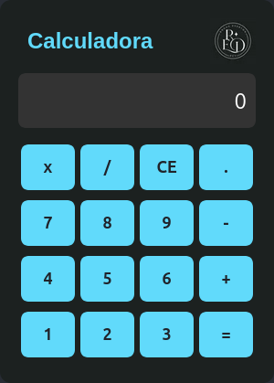

# Calculadora JavaScript – Versão Next.js


Esta é a versão **refatorada** de uma calculadora originalmente desenvolvida com **HTML, CSS e JavaScript puro**, agora recriada usando **Next.js**, com componentes reutilizáveis e melhor organização do código.

  

---

## 📸 Comparação Visual

<div style="display: flex; gap: 30px; flex-wrap: wrap;">

  
  

</div>


---

## 🎬 Demonstração

Para utilizar a calculadora clique no link abaixo:

<a href="https://calculadora-5b6gd8yhe-everton-rochas-projects.vercel.app/" target="_blank" rel="noopener noreferrer">
  Calculadora
</a>

---

## 💡 Sobre o projeto

**CalculatorJS** é um projeto pessoal para:

- Praticar lógica de programação e operações matemáticas.  
- Aprender React e Next.js com **estado reativo** (`useState`).  
- Criar uma interface modular, responsiva e escalável.

> A versão Next.js mantém todas as funcionalidades da versão original, mas com código mais limpo e organizado.

---

## ✨ Funcionalidades

- [x] Adição  
- [x] Subtração  
- [x] Multiplicação  
- [x] Divisão  
- [x] Limpar entrada (CE)  
- [x] Ponto decimal  
- [x] Interface responsiva e moderna

---

## 🚀 Tecnologias utilizadas

- **Next.js / React** – Estrutura e lógica da aplicação  
- **JavaScript** – Lógica das operações  
- **CSS3** – Estilização e responsividade


---

## 🛠️ Como executar

Clone o repositório e rode a versão Next.js localmente:

```bash
git clone https://github.com/RochaEverton/CalculatorJS.git
cd CalculatorJS
npm install
npm run dev
```

Abra [http://localhost:3000](http://localhost:3000) no navegador.